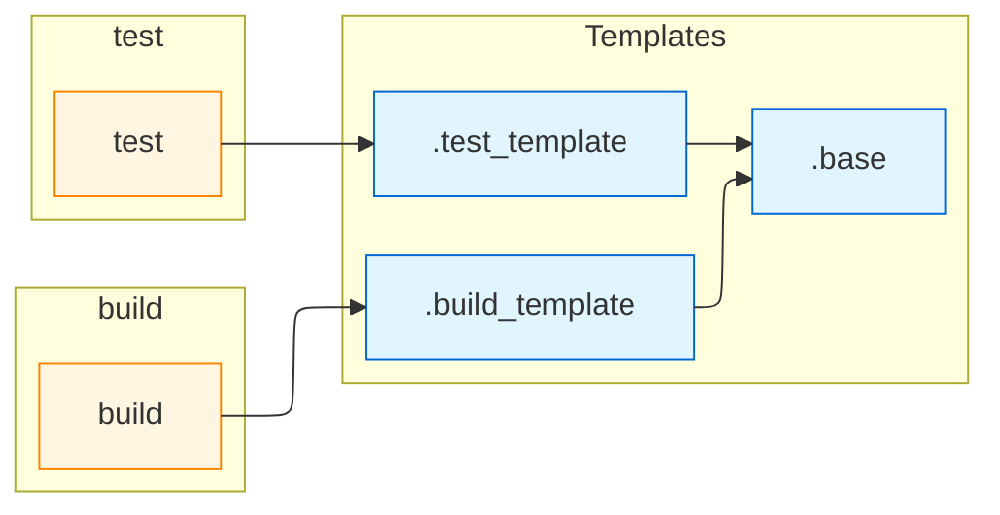

# gitlab-ci-builder

A TypeScript utility for programmatically building GitLab CI YAML configurations.

This project provides a fluent `ConfigBuilder` API to compose GitLab pipelines in code
and output a YAML-serializable JavaScript object. It focuses on strong TypeScript
types, proper extends resolution, and a simple builder surface.

## Features

- Fluent TypeScript API to declare `stages`, `jobs`, `templates`, `variables` and `include` entries
- **Command-line interface**: Visualize pipelines directly from the terminal with `gitlab-ci-builder visualize`
- **Import existing YAML**: Convert `.gitlab-ci.yml` files to TypeScript code using the builder API
- **Export to YAML**: Generate properly formatted YAML with customizable key ordering and spacing
- **Robust extends resolution**: Proper topological sorting, cycle detection, and merge strategies
- **Visualization tools**: Generate Mermaid diagrams, ASCII trees, and stage tables to visualize pipeline structure
- **Authentication support**: Access private repositories and includes with GitLab tokens
- Supports reusable template jobs (hidden jobs starting with `.`) with deep-merge semantics
- Dynamic TypeScript-based includes: import other files and apply their configuration functions
- Comprehensive test coverage (241 tests, 86%+ coverage)
- Small and dependency-light implementation

## Installation

```bash
pnpm add @noxify/gitlab-ci-builder
```

## Quick Start

Basic usage: create a `ConfigBuilder`, add jobs and produce a plain object that can be serialized to YAML.

```ts
import { ConfigBuilder } from "@noxify/gitlab-ci-builder"

const config = new ConfigBuilder()
  .stages("build", "test", "deploy")
  .variable("NODE_ENV", "production")
  .include({ local: "./common.yml" })

// Template job (hidden)
config.template(".base", { image: "node:18" })

config.extends(".base", "unittest", {
  stage: "test",
  script: ["npm run test"],
})

config.job("build", {
  stage: "build",
  script: ["npm ci", "npm run build"],
})

const plain = config.getPlainObject()
console.log(JSON.stringify(plain, null, 2))
```

## Command-Line Interface

The `gitlab-ci-builder` CLI provides tools for visualizing GitLab CI pipeline structure directly from the terminal.

### Installation

The CLI is included with the package:

```bash
pnpm add @noxify/gitlab-ci-builder
```

Or install globally:

```bash
pnpm add -g @noxify/gitlab-ci-builder
```

### Visualize Command

Generate visual representations of your pipeline structure:

```bash
# Visualize a local file (all formats)
gitlab-ci-builder visualize .gitlab-ci.yml

# Visualize a remote file with authentication
gitlab-ci-builder visualize https://gitlab.com/group/project/-/raw/main/.gitlab-ci.yml -t glpat-xxxx

# Generate only Mermaid diagram
gitlab-ci-builder visualize .gitlab-ci.yml -f mermaid

# Use environment variables for authentication
export GITLAB_TOKEN=glpat-xxxxxxxxxxxx
export GITLAB_HOST=gitlab.company.com
gitlab-ci-builder visualize https://gitlab.company.com/project/.gitlab-ci.yml

# Self-hosted GitLab instance
gitlab-ci-builder visualize pipeline.yml --host gitlab.company.com -t <token>
```

**Options:**

- `-f, --format <format>` - Output format: `mermaid`, `ascii`, `table`, `all` (default: `all`)
- `--show-stages` - Show stage information (default: `true`)
- `--show-remotes` - Show remote template sources (default: `true`)
- `-t, --token <token>` - Authentication token for private repositories (or use `GITLAB_TOKEN` env var)
- `--host <host>` - GitLab host for project/template includes (default: `gitlab.com`, or use `GITLAB_HOST` env var)
- `-h, --help` - Display help information
- `-v, --version` - Display version number

**Examples:**

```bash
# ASCII tree only
gitlab-ci-builder visualize .gitlab-ci.yml -f ascii

# Table view without remote indicators
gitlab-ci-builder visualize .gitlab-ci.yml -f table --show-remotes=false

# Private repository with token
gitlab-ci-builder visualize https://gitlab.com/private/repo/-/raw/main/.gitlab-ci.yml \
  -t glpat-xxxxxxxxxxxx

# Self-hosted GitLab with project includes
gitlab-ci-builder visualize pipeline.yml \
  --host gitlab.company.com \
  -t glpat-xxxxxxxxxxxx
```

**Note:** The token is used for:

- Fetching remote YAML files from private repositories
- Resolving `project:` includes recursively
- Resolving `remote:` includes to private URLs
- Accessing GitLab CI/CD templates from private instances

All visualization formats show:

- Job inheritance chains (extends relationships)
- Stage assignments
- Remote job/template indicators (🌐)
- Template markers ([T])

````

## Import & Export

### Exporting to YAML

Convert your ConfigBuilder to a properly formatted YAML file:

```ts
import { ConfigBuilder } from "@noxify/gitlab-ci-builder"

const config = new ConfigBuilder().stages("build", "test").job("build", {
  stage: "build",
  script: ["npm run build"],
})

// Convert to YAML string
const yamlString = config.toYaml()
console.log(yamlString)

// Or write directly to a file
await config.writeYamlFile(".gitlab-ci.yml")
````

The YAML output features:

- Logical key ordering (workflow, include, default, variables, stages, then jobs)
- Templates listed before regular jobs
- Blank lines between top-level sections for readability
- Empty sections automatically omitted

### Importing from YAML

Convert existing `.gitlab-ci.yml` files to TypeScript code:

```ts
import { fromYaml, importYamlFile } from "@noxify/gitlab-ci-builder"

// Convert YAML string to TypeScript code
const yamlContent = `
stages:
  - build
  - test

.base:
  image: node:22

build:
  extends: .base
  stage: build
  script:
    - npm run build
`

const tsCode = fromYaml(yamlContent)
console.log(tsCode)
// Output:
// import { ConfigBuilder } from "@noxify/gitlab-ci-builder"
//
// const config = new ConfigBuilder()
//
// config.stages("build", "test")
//
// config.template(".base", {
//   image: "node:22",
// })
//
// config.job("build", {
//   extends: ".base",
//   stage: "build",
//   script: ["npm run build"],
// })
//
// export default config

// Or import from file and optionally write to TypeScript file
await importYamlFile(".gitlab-ci.yml", "gitlab-ci.config.ts")
```

This enables easy migration from YAML to TypeScript-based configurations.

#### YAML Anchor Handling & Extends

The import functionality handles both GitLab CI's native `extends` keyword and YAML anchors/aliases:

##### Using `extends` (Recommended)

When your YAML uses GitLab's `extends` keyword, the import preserves the reference:

```yaml
.base:
  image: node:22
  tags:
    - docker

build:
  extends: .base # GitLab CI extends
  script:
    - npm run build
```

Generated output uses `extends` property:

```ts
config.template(".base", {
  image: "node:22",
  tags: ["docker"],
})

config.job("build", {
  extends: ".base", // Preserved!
  script: ["npm run build"],
})

// Or use the extends() helper method:
config.extends(".base", "build", {
  script: ["npm run build"],
})
```

Both approaches produce equivalent output. The `extends()` helper is more concise when you want to explicitly show the inheritance relationship.

##### Using YAML Anchors & Merges

When using YAML merge operators (`<<: *anchor`), values are resolved and inlined:

- **Anchor definitions** (`&anchor_name`) containing only primitive values (arrays, strings) are filtered out
- **References** (`*anchor_name`) and **merges** (`<<: *anchor_name`) are resolved by the YAML parser and inlined
- Only anchor definitions that are valid job/template objects are included as templates

```yaml
.tags_test: &tags_test # Filtered out (array-only anchor)
  - test1
  - test2

.base: &base_config # Included (valid template)
  image: node:22
  tags:
    - docker

build:
  <<: *base_config # Values merged inline
  tags: *tags_test # Reference resolved
  script:
    - npm run build
```

Generated output has resolved values:

```ts
config.template(".base", {
  image: "node:22",
  tags: ["docker"],
})

config.job("build", {
  image: "node:22", // Inlined from .base
  tags: ["test1", "test2"], // Resolved from .tags_test
  script: ["npm run build"],
})
```

**Recommendation:** Use GitLab's `extends` keyword instead of YAML merge operators to maintain clearer relationships in the generated TypeScript code.

### Dynamic TypeScript Includes

The `dynamicInclude` method allows you to modularize your GitLab CI configuration by splitting it across multiple TypeScript files. Each included file can export a configuration function that receives the main `ConfigBuilder` instance.

#### Basic Usage

```ts
import { ConfigBuilder } from "@noxify/gitlab-ci-builder"

const config = new ConfigBuilder()

// Include all config files from a directory
await config.dynamicInclude(process.cwd(), ["configs/**/*.ts"])

console.log(config.getPlainObject())
```

#### Creating Included Config Files

Included files can use either a **default export** (preferred) or a **named `extendConfig` export**. The exported function receives the `ConfigBuilder` instance, mutates it, and returns it for consistency with the fluent API.

**Option 1: Default Export (Recommended)**

```ts
// configs/build-jobs.ts
import type { ConfigBuilder } from "@noxify/gitlab-ci-builder"

export default function (config: ConfigBuilder) {

export default function (config: Config) {
  // Mutate the config instance directly
  config.stages("build")

  config.template(".node-base", {
    image: "node:22",
    before_script: ["npm ci"],
  })

  config.extends(".node-base", "build", {
    stage: "build",
    script: ["npm run build"],
  })

  return config
}
```

**Option 2: Named Export**

```ts
// configs/test-jobs.ts
import type { ConfigBuilder } from "@noxify/gitlab-ci-builder"

export function extendConfig(config: ConfigBuilder) {
  config.stages("test")

  config.job("unit-test", {
    stage: "test",
    script: ["npm run test:unit"],
  })

  config.job("integration-test", {
    stage: "test",
    script: ["npm run test:integration"],
  })

  return config
}
```

#### Complete Example

**Main configuration file:**

```ts
// build-pipeline.ts
import { ConfigBuilder } from "@noxify/gitlab-ci-builder"

async function main() {
  const config = new ConfigBuilder()

  // Set up base configuration
  config.stages("prepare", "build", "test", "deploy")
  config.variable("DOCKER_DRIVER", "overlay2")

  // Include additional configurations from separate files
  await config.dynamicInclude(process.cwd(), [
    "configs/build-jobs.ts",
    "configs/test-jobs.ts",
    "configs/deploy-jobs.ts",
  ])

  // Write the final pipeline configuration
  await config.writeYamlFile(".gitlab-ci.yml")
}

main()
```

**Separate config files:**

```ts
// configs/deploy-jobs.ts
import type { ConfigBuilder } from "@noxify/gitlab-ci-builder"

export default function (config: ConfigBuilder) {
  config.job("deploy-staging", {
    stage: "deploy",
    script: ["kubectl apply -f k8s/staging/"],
    environment: { name: "staging" },
    only: { refs: ["develop"] },
  })

  config.job("deploy-production", {
    stage: "deploy",
    script: ["kubectl apply -f k8s/production/"],
    environment: { name: "production" },
    only: { refs: ["main"] },
    when: "manual",
  })

  return config
}
```

#### Benefits

- **Modularity**: Split large pipelines into focused, manageable files
- **Reusability**: Share common job configurations across multiple pipelines
- **Team collaboration**: Different teams can maintain their own config files
- **Type safety**: Full TypeScript support with autocomplete and type checking

**Note:** If both default and named exports are present, the default export takes precedence.

## Visualization

The builder provides powerful visualization tools to help understand and document your pipeline structure. You can generate Mermaid diagrams, ASCII trees, and stage tables that show job relationships, inheritance chains, and stage organization.

### Available Visualizations

All visualization functions accept a unified parameter object with:

- `graph`: The extends graph containing job metadata
- `resolvedConfig`: The resolved pipeline configuration with job definitions
- `options`: Visualization options (optional)

#### Mermaid Diagrams

Generate [Mermaid](https://mermaid.js.org/) flowchart diagrams showing job relationships and inheritance:

```ts
import { ConfigBuilder } from "@noxify/gitlab-ci-builder"

const config = new ConfigBuilder()
  .stages("build", "test", "deploy")
  .template(".base", { image: "node:22" })
  .extends(".base", "build", { stage: "build", script: ["npm run build"] })
  .extends(".base", "test", { stage: "test", script: ["npm test"] })

const mermaid = config.generateMermaidDiagram({
  showStages: true,
  showRemote: true,
})

console.log(mermaid)
```

**Output:**



#### ASCII Trees

Generate hierarchical ASCII tree views of job inheritance using `oo-ascii-tree` for clean, professional box-drawing characters:

```ts
const ascii = config.generateAsciiTree({
  showStages: true,
  showRemote: true,
})

console.log(ascii)
```

**Output:**

```
build (build)
 └─┬ .build_template [T]
   └── .base [T]
test (test)
 └─┬ .test_template [T]
   └── .base [T]
```

The ASCII tree uses Unicode box-drawing characters for a clean, readable hierarchy that works great in terminal output and documentation.

#### Stage Tables

Generate formatted tables using `climt` showing jobs with their full inheritance chains:

```ts
const table = config.generateStageTable({
  showRemote: true,
})

console.log(table)
```

**Output:**

```
┌───────┬────────────────────────────────────────────┐
│ STAGE │ JOB                                        │
├───────┼────────────────────────────────────────────┤
│ build │ build-frontend ← .build_template ← .base   │
│ build │ build-backend ← .build_template ← .base    │
│ test  │ test-unit ← .test_template ← .base         │
│ test  │ test-e2e ← .test_template ← .base          │
└───────┴────────────────────────────────────────────┘
```

The table shows one job per row with its complete extends chain, making it easy to understand the full inheritance hierarchy at a glance.

### Visualization Options

All visualization methods accept optional configuration:

```ts
interface VisualizationOptions {
  showRemote?: boolean // Show remote jobs/templates with 🌐 indicator
  showStages?: boolean // Show stage information in output
  highlightCycles?: boolean // Highlight circular dependencies (future)
}
```

### Using Visualization Functions Directly

You can also use the visualization functions directly with the extends graph and resolved config:

```ts
import {
  ConfigBuilder,
  generateAsciiTree,
  generateMermaidDiagram,
  generateStageTable,
} from "@noxify/gitlab-ci-builder"

const config = new ConfigBuilder()
// ... configure jobs ...

const graph = config.getExtendsGraph()
const resolvedConfig = config.getPlainObject({ skipValidation: true })

// Generate visualizations
const mermaid = generateMermaidDiagram({
  graph,
  resolvedConfig,
  options: { showStages: true },
})

const ascii = generateAsciiTree({
  graph,
  resolvedConfig,
  options: { showRemote: true },
})

const table = generateStageTable({
  graph,
  resolvedConfig,
  options: { showStages: false },
})
```

### Visualizing YAML with Includes

The `visualizeYaml` function can parse YAML content and generate visualizations, including support for resolving `project:` and `remote:` includes with authentication:

```ts
import { visualizeYaml } from "@noxify/gitlab-ci-builder"

const yamlContent = `
include:
  - project: 'my-group/my-project'
    file: '/templates/common.yml'
  - remote: 'https://gitlab.company.com/shared/base.yml'

stages: [build, test, deploy]

build:
  stage: build
  script: npm run build
`

// Visualize with authentication for private includes
const result = await visualizeYaml(yamlContent, {
  format: "mermaid",
  showStages: true,
  showRemotes: true,
  gitlabToken: "glpat-xxxxxxxxxxxx", // For private repositories
  gitlabUrl: "https://gitlab.company.com", // For self-hosted instances
})

console.log(result.mermaid)

// Generate all formats at once
const allFormats = await visualizeYaml(yamlContent, {
  format: "all",
  gitlabToken: process.env.GITLAB_TOKEN,
})

console.log(allFormats.mermaid)
console.log(allFormats.ascii)
console.log(allFormats.table)
```

**Authentication Options:**

- `gitlabToken` - Authentication token for resolving private `project:` and `remote:` includes
- `gitlabUrl` - GitLab host URL for `project:` includes (default: `https://gitlab.com`)

The token is passed recursively through all include levels, so nested includes in private repositories are also resolved correctly.

### Remote Job/Template Indicators

When working with remote includes, jobs and templates can be marked with the `🌐` indicator when `showRemote: true`:

```ts
const config = new ConfigBuilder()
  .template(".remote-base", { image: "alpine" }, { remote: true })
  .extends(".remote-base", "local-job", { script: ["echo hello"] })

const ascii = config.generateAsciiTree({ showRemote: true })
// Output shows: .remote-base [T] 🌐
```

This helps distinguish between locally-defined and remotely-included configurations when debugging complex pipelines.

## Job Options & Global Settings

### Job Options

The `job()`, `template()`, and `extends()` methods accept an optional `JobOptions` object for fine-grained control:

```ts
interface JobOptions {
  hidden?: boolean // Mark as template (prefix with dot)
  mergeExisting?: boolean // Merge with existing job/template (default: true)
  mergeExtends?: boolean // Merge extends (default: true)
  resolveTemplatesOnly?: boolean // Only merge templates (names starting with .)
  remote?: boolean // Mark job/template as remote (excluded from merging)
}
```

**Example:**

```ts
const config = new ConfigBuilder()

// Create a hidden template
config.job("base", { image: "node:22" }, { hidden: true })
// Same as: config.template(".base", { image: "node:22" })

// Replace instead of merge
config.job("build", { stage: "build", script: ["npm run build"] })
config.job("build", { script: ["npm run build:prod"] }, { mergeExisting: false })
// Result: { script: ["npm run build:prod"] } (stage removed)

// Keep extends reference (don't resolve parent)
config.template(".base", { script: ["base command"] })
config.job("child", { extends: ".base" }, { mergeExtends: false })
// Output keeps: extends: ".base"

// Only merge templates, ignore jobs without dot
config.template(".base", { script: ["template"] })
config.job("basejob", { script: ["job"] })
config.job(
  "child",
  { extends: [".base", "basejob"], stage: "test" },
  { resolveTemplatesOnly: true },
)
// Output: script: ["template"], extends removed

// Mark job/template as remote (excluded from merging)
config.job("remote-job", { script: ["do something remote"] }, { remote: true })
config.template(".remote-template", { script: ["remote template"] }, { remote: true })
// These will be ignored during merging and not appear in the output
```

### Global Options

Set default behavior for all jobs using `globalOptions()`. Job-level options override global settings:

```ts
const config = new ConfigBuilder()

// Disable extends merging globally
config.globalOptions({ mergeExtends: false })

// Only merge templates globally
config.globalOptions({ resolveTemplatesOnly: true })

config.template(".base", { script: ["base"] })
config.job("basejob", { script: ["job"] })

// This job keeps extends (global setting)
config.job("job1", { extends: ".base" })
// Output: { extends: ".base" }

// This job merges only templates (global setting)
config.job("job2", { extends: [".base", "basejob"], stage: "test" })
// Output: script: ["base"], extends removed

// This job merges all (local override)
config.job(
  "job3",
  { extends: [".base", "basejob"], stage: "test" },
  { resolveTemplatesOnly: false },
)
// Output: script: ["job", "base"], extends removed
```

**Use Cases:**

- **Preserve extends in output**: Set `mergeExtends: false` to keep GitLab CI's native `extends` keyword instead of inlining parent properties.
- **Strict replacement**: Set `mergeExisting: false` globally to prevent accidental job merging and always replace jobs/templates.
- **Conditional template resolution**: Set `resolveTemplatesOnly: true` to only merge templates (names starting with `.`), ignoring regular jobs during extends resolution.
- **Remote jobs/templates**: Set `remote: true` on individual jobs or templates to exclude them from merging and output. This is only available at the job/template level. Use this for jobs/templates defined in external includes or that should not be processed locally.
  - **Shadow-overrides for remote jobs/templates**: If a job or template is marked as `remote: true`, it will be ignored during merging and output. However, you can locally define a job/template with the same name (without `remote: true`) to override or "shadow" the remote definition. This allows you to selectively replace or extend remote jobs/templates in your local pipeline configuration.

## API Reference

This reference summarizes the primary `ConfigBuilder` API surface. Method signatures reflect
the runtime builder and are derived from the JSDoc on the source `ConfigBuilder` class.

- `new ConfigBuilder()`
  - Create a new builder instance.

- `stages(...stages: string[]): ConfigBuilder`
  - Add stages to the global stage list. Ensures uniqueness and preserves order.

- `addStage(stage: string): ConfigBuilder`
  - Convenience wrapper for adding a single stage.

- `globalOptions(options: GlobalOptions): ConfigBuilder`
  - Set global options that apply to all jobs and templates.
  - Options: `{ mergeExtends?: boolean, mergeExisting?: boolean, resolveTemplatesOnly?: boolean, remote?: boolean }`
    - Options: `{ mergeExtends?: boolean, mergeExisting?: boolean, resolveTemplatesOnly?: boolean }`
  - Job-level options override global settings.

- `workflow(workflow: Workflow): ConfigBuilder`
  - Set or deep-merge the top-level `workflow` configuration (typically `rules`).

- `defaults(defaults: Defaults): ConfigBuilder`
  - Set global default job parameters (deep-merged with existing defaults).

- `variable(key: string, value: string | number | boolean | undefined): ConfigBuilder`
  - Set a single global variable.

- `variables(vars: Variables): ConfigBuilder`
  - Merge multiple global variables at once.

- `getVariable(job: string, key: string): string | number | boolean | undefined`
  - Retrieve a variable by checking job-local variables first, then global variables.

- `getJob(name: string): JobDefinition | undefined`
  - Look up a job or template definition by name (templates start with `.`).

- `template(name: string, definition: JobDefinitionInput, options?: JobOptions): ConfigBuilder`
  - Define or deep-merge a hidden template job. The stored template name will have a leading `.`.
  - Options: `{ mergeExisting?: boolean, mergeExtends?: boolean, resolveTemplatesOnly?: boolean, hidden?: boolean, remote?: boolean }`

- `include(items: Include | Include[]): ConfigBuilder`
  - Add include entries. Accepts objects or arrays of include definitions.

- `job(name: string, definition: JobDefinitionInput, options?: JobOptions): ConfigBuilder`
  - Create or merge a job. If `name` starts with `.` or `options.hidden` is true, the call delegates
    to `template()` and ensures a single leading `.` on the stored template name.
  - Options: `{ hidden?: boolean, mergeExisting?: boolean, mergeExtends?: boolean, resolveTemplatesOnly?: boolean, remote?: boolean }`

- `macro<T extends MacroArgs>(key: string, callback: (config: ConfigBuilder, args: T) => void): void`
  - Register a macro function for programmatic job generation.

- `from<T extends MacroArgs>(key: string, args: T): void`
  - Invoke a previously registered macro.

- `extends(fromName: string | string[], name: string, job?: JobDefinitionInput, options?: JobOptions): ConfigBuilder`
  - Create a job that will extend one or more templates/jobs (injects an `extends` property).
  - Options: `{ hidden?: boolean, mergeExisting?: boolean, mergeExtends?: boolean, resolveTemplatesOnly?: boolean, remote?: boolean }`

- `dynamicInclude(cwd: string, globs: string[]): Promise<void>`
  - Import TypeScript modules matched by the provided globs and call their exported `extendConfig`.

- `patch(callback: (plain: GitLabCi) => void): void`
  - Register a patcher callback that runs on the plain object before it is returned.

- `validate(): void`
  - Validate the configuration and throw an error if validation fails. Logs warnings to console.

- `safeValidate(): SafeValidationResult`
  - Validate the configuration without throwing. Returns `{ valid: boolean, errors: ValidationError[], warnings: ValidationError[] }`.

- `getPlainObject(options?: { skipValidation?: boolean }): PipelineOutput`
  - Return a YAML-serializable pipeline object with resolved extends and applied patchers.
  - By default, validates before returning. Set `skipValidation: true` to skip validation (e.g., after calling `safeValidate()`).

- `toJSON(options?: { skipValidation?: boolean }): PipelineOutput`
  - Alias for `getPlainObject()` (useful for `JSON.stringify`).

- `getExtendsGraph(): Map<string, ExtendsGraphNode>`
  - Return the extends graph containing job metadata and relationships.

- `generateMermaidDiagram(options?: VisualizationOptions): string`
  - Generate a Mermaid flowchart diagram showing job relationships and inheritance.
  - Options: `{ showStages?: boolean, showRemote?: boolean, highlightCycles?: boolean }`

- `generateAsciiTree(options?: VisualizationOptions): string`
  - Generate an ASCII tree view of job inheritance hierarchy.
  - Options: `{ showStages?: boolean, showRemote?: boolean, highlightCycles?: boolean }`

- `generateStageTable(options?: VisualizationOptions): string`
  - Generate a tabular view showing jobs organized by stage.
  - Options: `{ showStages?: boolean, showRemote?: boolean, highlightCycles?: boolean }`

- `toYaml(options?: { skipValidation?: boolean }): string`
  - Convert the configuration to a formatted YAML string.

- `writeYamlFile(filePath: string): Promise<void>`
  - Write the configuration to a YAML file.

### Export Functions

- `toYaml(config: PipelineOutput): string`
  - Convert a pipeline configuration to a formatted YAML string. Features logical key ordering,
    blank lines between sections, and proper formatting for readability.

- `writeYamlFile(filePath: string, config: PipelineOutput): Promise<void>`
  - Write a pipeline configuration to a YAML file.

### Import Functions

- `fromYaml(yamlContent: string): string`
  - Convert a GitLab CI YAML string to TypeScript code using the `Config` builder API.
    Parses the YAML and generates corresponding TypeScript statements.

- `importYamlFile(yamlPath: string, outputPath?: string): Promise<string>`
  - Read a GitLab CI YAML file and convert it to TypeScript code. If `outputPath` is provided,
    the generated code is written to that file. Returns the generated TypeScript code.

### Visualization Functions

- `generateMermaidDiagram({ graph, resolvedConfig, options? }): string`
  - Generate a Mermaid flowchart diagram from an extends graph and resolved configuration.
  - Parameters: `{ graph: Map<string, ExtendsGraphNode>, resolvedConfig: ResolvedPipelineConfig, options?: VisualizationOptions }`

- `generateAsciiTree({ graph, resolvedConfig, options? }): string`
  - Generate an ASCII tree view from an extends graph and resolved configuration.
  - Parameters: `{ graph: Map<string, ExtendsGraphNode>, resolvedConfig: ResolvedPipelineConfig, options?: VisualizationOptions }`

- `generateStageTable({ graph, resolvedConfig, options? }): string`
  - Generate a stage table from an extends graph and resolved configuration.
  - Parameters: `{ graph: Map<string, ExtendsGraphNode>, resolvedConfig: ResolvedPipelineConfig, options?: VisualizationOptions }`

## Testing

The project includes unit tests run via Vitest. Run the test suite with:

```bash
pnpm test
```

## Contributing & License

Contributions welcome — open issues or PRs. This repository is published under
the same license included in the project root (`LICENSE`).

## Credits

This project is based on and inspired by the following repositories:

- `node-gitlab-ci` by devowlio: https://github.com/devowlio/node-gitlab-ci
- `gitlab-yml` by netinsight: https://github.com/netinsight/gitlab-yml

Parts of the API and types were adapted from those projects; this repository
intentionally focuses on a minimal, typed builder rather than reproducing all
runtime behaviors.

## Development Notes

Significant portions of this codebase, including the import/export functionality,
test coverage improvements, and documentation enhancements, were developed with the assistance of AI (GitHub Copilot / Claude).

While the core architecture and original implementation come from the credited repositories above,
many recent additions and refactorings were created through AI-assisted pair programming.
